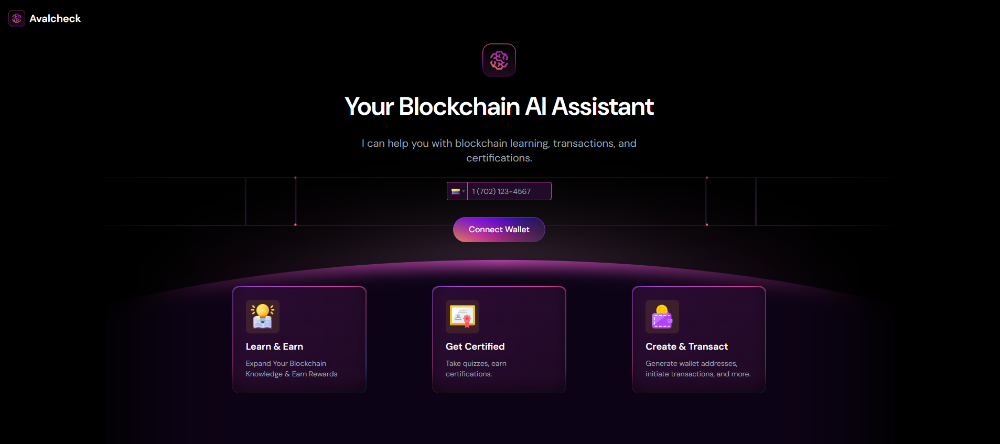
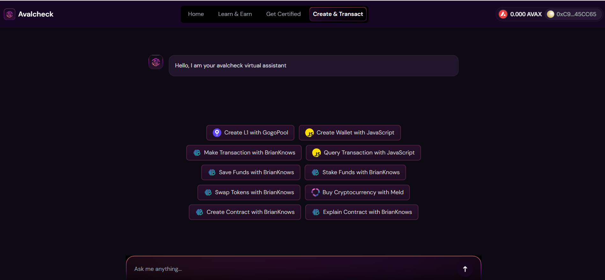

# **Avalcheck Monorepo**

## **Demo**

- **Live Demo**: [https://avalcheck.com](https://avalcheck.com)
- **Video Presentation**: [https://www.loom.com/share/b5304c48999a46c298d33fd0e73e7678](https://www.loom.com/share/b5304c48999a46c298d33fd0e73e7678)

---

## **Frontend Screenshots**

### **User Interface Preview**





---

## **Introduction**

Avalcheck is an innovative blockchain-based platform designed to provide a comprehensive learning and transaction experience for users. This monorepo contains two key components: `avalcheck-frontend` and `avalcheck-backend`. Below, you will find detailed instructions on how to install, configure, and deploy both components.

---

## **Prerequisites**

Ensure you have the following tools and dependencies installed:

- **Node.js** (v16 or later)
- **PostgreSQL**
- **Git**

---

## **Project Structure**

```plaintext
avalcheck/
├── avalcheck-frontend/
├── avalcheck-backend/
```

---

## **Frontend**

The `avalcheck-frontend` is a React-based web application that allows users to interact with Avalcheck’s features, including learning modules, certifications, and blockchain transactions.

### **Features**

- **Learn & Earn:** Users can complete modules to earn AVAX rewards.
- **Get Certified:** Take quizzes to gain blockchain certifications.
- **Create & Transact:** Create wallets, perform transactions, and interact with blockchain services.
- **Dynamic UI:** Built using modern React libraries for an intuitive experience.

### **Installation and Usage**

#### **Commands**

1. **Clone the repository:**

   ```bash
   git clone https://github.com/your-repo/avalcheck.git
   ```

2. **Navigate to the frontend directory:**

   ```bash
   cd avalcheck/avalcheck-frontend
   ```

3. **Install dependencies:**

   ```bash
   yarn install
   ```

4. **Run the development server:**

   ```bash
   yarn dev
   ```

5. **Build for production:**

   ```bash
   yarn build
   ```

6. **Preview production build:**
   ```bash
   yarn start
   ```

#### **Environment Configuration**

Create a `.env` file with the following variables:

```env
VITE_URL=<your_frontend_url>
```

---

## **Backend**

The `avalcheck-backend` is a NestJS-based API that powers Avalcheck’s features, such as user authentication, data management, and blockchain interaction.

### **Features**

- **Authentication:** Secure JWT-based user authentication.
- **Blockchain Interaction:** Handles wallet creation, transactions, and contract calls.
- **Data Management:** Tracks user progress and certifications.
- **Scalable Architecture:** Built with NestJS for modularity and maintainability.

### **Installation and Usage**

#### **Commands**

1. **Navigate to the backend directory:**

   ```bash
   cd avalcheck/avalcheck-backend
   ```

2. **Install dependencies:**

   ```bash
   npm install
   ```

3. **Run the development server:**

   ```bash
   npm run start:dev
   ```

4. **Build for production:**

   ```bash
   npm run build
   ```

5. **Start the production server:**
   ```bash
   npm run start:prod
   ```

#### **Environment Configuration**

Create a `.env` file with the following variables:

```env
OPENAI_API_KEY=<your_api_key>
PORT=<your_port>
CONEXIONSTARTOKENPROJECT=<your_token_project>
URLCONEXIONSTAR=<your_url_conexionstar>
MODELGPT=<model_gpt>
DBINFO=<database_information>
```

---

## **Deployment**

### **Frontend Deployment**

Use a modern hosting service such as Vercel or Netlify. Ensure the `vite.config.js` is configured correctly for your environment.

### **Backend Deployment**

Deploy the backend on cloud services such as AWS, Azure, or DigitalOcean. Ensure the PostgreSQL database is accessible, and all environment variables are correctly set.

---

## **Technologies Used**

- **React**: Frontend framework.
- **Vite**: Build tool for fast development.
- **TailwindCSS**: Styling framework.
- **NestJS**: Backend framework.
- **Prisma**: ORM for database management.
- **Ethers.js**: Blockchain interaction library.
- **OpenAI API**: AI-based functionalities.
- **Puppeteer**: For generating certificates.

---

## **License**

This project is licensed under the UNLICENSED license.

---

For any questions or issues, please contact the Avalcheck development team.
